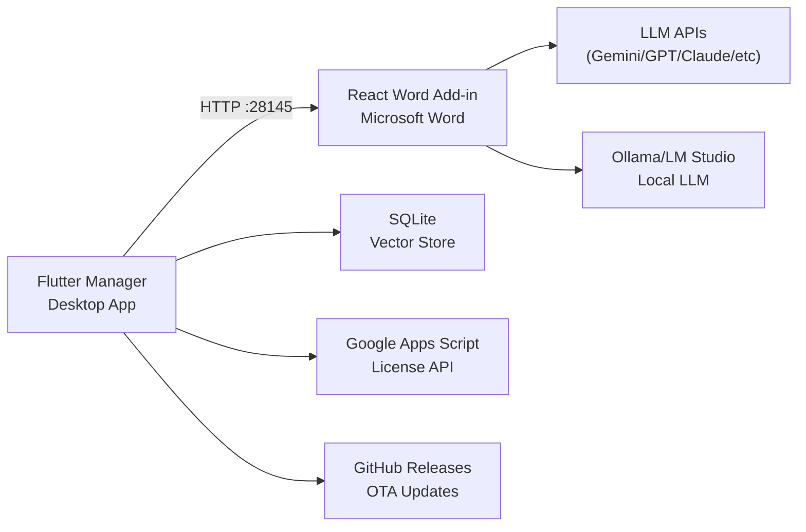

# Walkthrough: Super Skripsi Gandi Ecosystem

## Overview
Built a complete dual-environment research assistant ecosystem from scratch:
- **Flutter Manager** (Control Center / Backend) — 25+ files
- **React Word Add-in** (Writing Interface) — 15+ files
- Connected via **localhost HTTP API** on port `28145`

## Architecture

## Flutter Manager — Key Components

| Component | File | Purpose |
|---|---|---|
| Theme | [glassmorphism_theme.dart](file:///d:/SUPER%20SKRIPSI%20GANDI/super_skripsi_manager/lib/theme/glassmorphism_theme.dart) | iOS-style design tokens, red accent palette |
| License Gate | [license_service.dart](file:///d:/SUPER%20SKRIPSI%20GANDI/super_skripsi_manager/lib/services/license_service.dart) → [license_gate_page.dart](file:///d:/SUPER%20SKRIPSI%20GANDI/super_skripsi_manager/lib/pages/license_gate_page.dart) | Cloud auth via Google Apps Script |
| OTA Updater | [updater_service.dart](file:///d:/SUPER%20SKRIPSI%20GANDI/super_skripsi_manager/lib/services/updater_service.dart) → [settings_page.dart](file:///d:/SUPER%20SKRIPSI%20GANDI/super_skripsi_manager/lib/pages/settings_page.dart) | GitHub Releases semantic version check |
| API Keys | [api_key_service.dart](file:///d:/SUPER%20SKRIPSI%20GANDI/super_skripsi_manager/lib/services/api_key_service.dart) → [api_keys_page.dart](file:///d:/SUPER%20SKRIPSI%20GANDI/super_skripsi_manager/lib/pages/api_keys_page.dart) | Encrypted storage for 6 LLM providers |
| PDF Pipeline | [pdf_service.dart](file:///d:/SUPER%20SKRIPSI%20GANDI/super_skripsi_manager/lib/services/pdf_service.dart) → [hashing_service.dart](file:///d:/SUPER%20SKRIPSI%20GANDI/super_skripsi_manager/lib/services/hashing_service.dart) → [chunking_service.dart](file:///d:/SUPER%20SKRIPSI%20GANDI/super_skripsi_manager/lib/services/chunking_service.dart) → [ai_extraction_service.dart](file:///d:/SUPER%20SKRIPSI%20GANDI/super_skripsi_manager/lib/services/ai_extraction_service.dart) | Full zero-input archiving |
| Vector Store | [vector_store_service.dart](file:///d:/SUPER%20SKRIPSI%20GANDI/super_skripsi_manager/lib/services/vector_store_service.dart) | SQLite + TF-IDF cosine similarity |
| HTTP Server | [local_server_service.dart](file:///d:/SUPER%20SKRIPSI%20GANDI/super_skripsi_manager/lib/services/local_server_service.dart) | CORS-enabled REST API bridge |
| Nav Dock | [glass_nav_dock.dart](file:///d:/SUPER%20SKRIPSI%20GANDI/super_skripsi_manager/lib/widgets/glass_nav_dock.dart) | macOS-style floating dock with hover animations |

## React Word Add-in — Key Components

| Component | File | Purpose |
|---|---|---|
| CSS System | [glassmorphism.css](file:///d:/SUPER%20SKRIPSI%20GANDI/super_skripsi_addin/src/taskpane/styles/glassmorphism.css) + [index.css](file:///d:/SUPER%20SKRIPSI%20GANDI/super_skripsi_addin/src/taskpane/styles/index.css) | Frosted glass design system |
| Zustand Store | [appStore.js](file:///d:/SUPER%20SKRIPSI%20GANDI/super_skripsi_addin/src/taskpane/stores/appStore.js) | Global state with auto-init |
| LLM Router | [llmRouter.js](file:///d:/SUPER%20SKRIPSI%20GANDI/super_skripsi_addin/src/taskpane/services/llmRouter.js) | 8 providers (6 cloud + Ollama + LM Studio) |
| Prompt Engine | [promptBase.js](file:///d:/SUPER%20SKRIPSI%20GANDI/super_skripsi_addin/src/taskpane/services/promptBase.js) | 3-way JSON output + regex cleaner |
| RAG Service | [ragService.js](file:///d:/SUPER%20SKRIPSI%20GANDI/super_skripsi_addin/src/taskpane/services/ragService.js) | Context-aware chunk retrieval |
| Word Injector | [wordInjector.js](file:///d:/SUPER%20SKRIPSI%20GANDI/super_skripsi_addin/src/taskpane/services/wordInjector.js) | `Word.run()` cursor injection with APA formatting |
| Chat Panel | [ChatPanel.jsx](file:///d:/SUPER%20SKRIPSI%20GANDI/super_skripsi_addin/src/taskpane/components/ChatPanel.jsx) | Unified bento chat interface |
| Response Card | [ResponseCard.jsx](file:///d:/SUPER%20SKRIPSI%20GANDI/super_skripsi_addin/src/taskpane/components/ResponseCard.jsx) | Verbatim / Parafrase / Sitasi cards |
| Parafrase Panel | [ParafrasePanel.jsx](file:///d:/SUPER%20SKRIPSI%20GANDI/super_skripsi_addin/src/taskpane/components/ParafrasePanel.jsx) | Intelligent academic paraphrasing with auto-capture |
| Prompt Builder | [parafrasePrompt.js](file:///d:/SUPER%20SKRIPSI%20GANDI/super_skripsi_addin/src/taskpane/services/parafrasePrompt.js) | Strict rules for citation and length preservation |

## Key Features & Highlights

### 1. Stop Generation & Thinking Logs
- **Instant Abort**: Stop AI generation immediately via `AbortController`.
- **Transparency**: Real-time logs showing LLM "thoughts" and key rotation.

### 2. Document Category Filtering
- **Dynamic Filter**: Filter archived documents by automatically extracted categories.
- **Glassmorphism UI**: Premium dropdown matching the global design system.

### 3. Academic Parafrase Tab
- **Auto-Grab**: Directly reads selected text from Microsoft Word via Office.js.
- **Strict Citation Preservation**: AI is forbidden from adding/removing citations.
- **Multi-Style & Multi-Language**: 4 styles, 3 formats, and 5 languages (ID, JA, ES, AR, DE).

### 4. Gemini Flow Local Integration
- **Unified Bridge**: Supports custom endpoints like `http://localhost:3000/api/deepseek`.
- **Intelligent Routing**: Automatically detects direct API bridges vs OpenAI-compatible local servers (Ollama/LM Studio).
- **Structured Extraction**: Professional theory extraction in the Research Hub now correctly routes through the Gemini Flow bridge.

## Validation Results
- **Localhost Routing**: ✅ Verified for both Parafrase and Research Hub.
- **Model Selection**: ✅ Restored across all UI components for custom providers.
- **Naming Consistency**: ✅ Updated "Index RAG" to "Ekstrak Teori ke RAG".
- **Flutter analyze**: ✅ 0 errors, 0 warnings.

